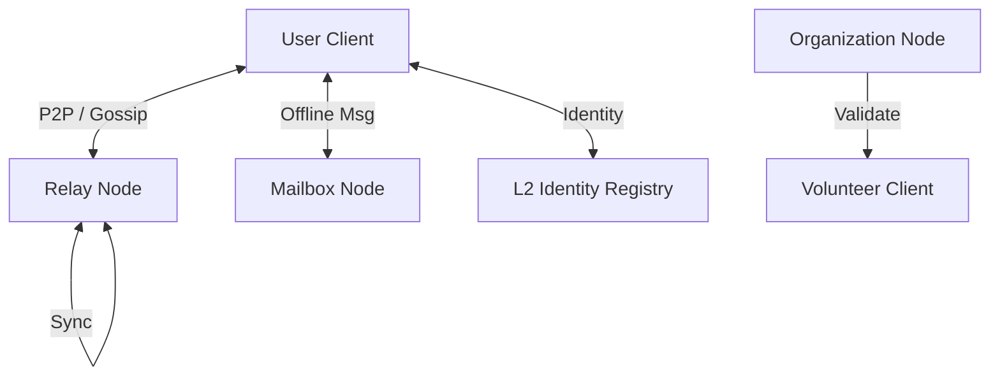

# Ratatoskr Architecture Reference

## 1. System Overview

Ratatoskr operates as a decentralized network with a hybrid architecture combining Peer-to-Peer (P2P) direct messaging, Distributed Ledger Technology (DLT) for identity, and a "Store-and-Forward" network for offline delivery.

### High-Level Components

## 2. Node Roles

A single physical server or device can perform multiple roles, but logically they are distinct:

### A. Client Node (User/Volunteer)
- **Platform:** Mobile (Android/iOS), Desktop (Tauri), Embedded.
- **Function:** 
  - Key management (Ed25519/X25519).
  - E2EE Encryption/Decryption.
  - Local Storage (SQLite) of message history.
  - **Does NOT** listen on public ports (typically behind NAT).

### B. Relay Node (The "Pipe")
- **Function:** High-bandwidth packet routing.
- **Protocol:** GossipSub (libp2p).
- **Storage:** Ephemeral (RAM only). Holds messages for seconds to propagate them to subscribers.
- **Use Case:** Public chat channels, "Black Box SOS" broadcasting.

### C. Mailbox Node (The "Storage")
- **Function:** Stores encrypted messages for offline users.
- **Protocol:** Request/Response (Direct).
- **Storage:** Persistent (Disk).
- **Privacy:** **Blind Storage**. The Mailbox knows *who* the message is for (Public Key), but not *who* sent it or *what* is inside. 
- **Anti-Spam:** Requires a Proof-of-Work token or a whitelisted signature to accept a message for storage.

### D. Organization/Dispatch Node
- **Function:** Command center for emergency response.
- **Capabilities:**
  - Holds high-privilege Private Keys to decrypt SOS signals.
  - Issues **Verifiable Credentials (VCs)** to Volunteers (e.g., "Certified Medic").
  - Manages the "Web of Trust".

---

## 3. Data Flow Scenarios

### Scenario 1: Offline Messaging (Async)
1. **Alice** wants to send a message to **Bob**.
2. Alice resolves Bob's DID (Decentralized Identifier) from the Blockchain/DHT.
3. Bob's DID Document contains a list of **Service Endpoints** (his chosen Mailboxes).
   - `did:ratatoskr:bob123 -> { mailbox: "node-5.ratatoskr.net" }`
4. Alice connects to `node-5` and uploads an encrypted blob addressed to Bob.
5. `node-5` stores the blob.
6. **Bob** comes online, connects to `node-5`, authenticates with his Private Key, and downloads pending blobs.
7. Bob deletes the blobs from the server after download.

### Scenario 2: Black Box SOS (Emergency)
1. **User** activates SOS Mode.
2. Client encrypts location/status with the **Organization's Public Key**.
3. Client wraps this payload in an **Anonymous Envelope** (ephemeral keys).
4. Client broadcasts the envelope via **GossipSub** to *any* available peer (Mesh or Internet).
5. Peers relay the packet blindly until it reaches an **Organization Node**.
6. Organization decrypts the packet and dispatches help.

---

## 4. Trust & Access Control (Volunteers & Reputation)

We use a **Web of Trust (WoT)** model anchored by Organizations and a decentralized reputation system ("Plague Protocol").

### A. Volunteer Verification
- **Verifiable Credentials (VC):**
  - An Organization signs a certificate: `{ "subject": "Volunteer_PublicKey", "role": "Medic", "exp": 2026-01-01 }`.
  - This certificate is stored on the Volunteer's device.
- **Dispatching:**
  - When an Organization receives an SOS, they look for active peers with valid VCs.
  - The Organization sends the coordinates *only* to the selected Volunteer, encrypted with the Volunteer's key.

### B. The Plague Protocol (Reputation System)
To manage spam and malicious actors without central authority:
- **Infection:** Nodes can flag peers as "Infected" (malicious). This flag propagates through the Web of Trust.
- **Quarantine (Leper Colony):** Messages from nodes with a low reputation score are dropped by relays for public channels.
- **SOS Immunity:** `SOS` signals are **exempt** from reputation filtering. Saving a life takes precedence over social moderation.

---

## 5. Storage Layer (User Device)

- **Engine:** SQLite (via SQLx).
- **Encryption:** SQLCipher or Application-level AES-GCM encryption of database rows.
- **Plausible Deniability (Duress Mode):**
  - **Decoy Database:** A secondary, innocuous database unlocked by a different password.
  - **Panic Wipe:** A "Panic PIN" or hardware trigger instantly shreds the encryption keys from memory and disk, rendering the primary database permanently unrecoverable.
- **Schema:**
  - `contacts`: DIDs, Public Keys, Nicknames.
  - `messages`: content (encrypted), timestamp, status (sent/delivered), type (text/image/sos).
  - `credentials`: Own certificates and certificates of trusted organizations.
